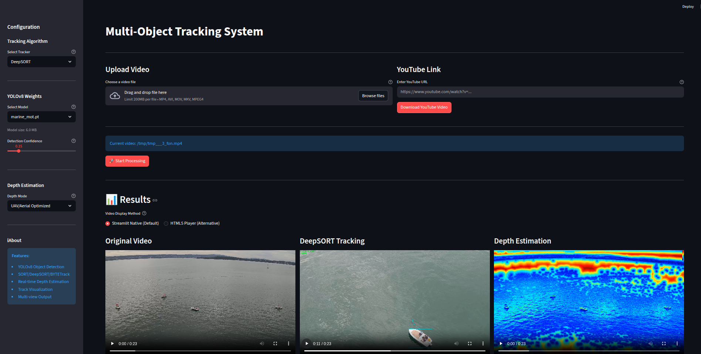

# Multi-Object Tracking (MOT) System with Depth Estimation


A comprehensive real-time Multi-Object Tracking system built with Streamlit, featuring YOLOv8 detection, multiple tracking algorithms (SORT, DeepSORT, BYTETrack), and depth estimation using MiDaS.

## 🌟 Features

- **YOLOv8 Detection**: State-of-the-art object detection
- **Multiple Tracking Algorithms**:
  - SORT (Simple Online and Realtime Tracking)
  - DeepSORT (Deep Learning based SORT with appearance features)
  - BYTETrack (Multi-object tracking by associating every detection box)
- **Real-time Depth Estimation**: MiDaS-based monocular depth estimation
- **Interactive Streamlit UI**: User-friendly web interface
- **Video Sources**: Upload local videos or download from YouTube
- **Triple View Output**: Original, Tracking, and Depth estimation videos
- **Track Visualization**: Colored bounding boxes and polylines for each tracked object

## 📋 Requirements

- Python 3.8+
- CUDA-capable GPU (recommended for faster processing)
- Webcam (optional, for real-time tracking)

## 🚀 Installation

### 1. Clone or Download the Project

```bash
# If you have the project files
cd multi-object-tracking
```

### 2. Create Virtual Environment (Recommended)

```bash
# Using venv
python -m venv venv

# Activate on Windows
venv\Scripts\activate

# Activate on Linux/Mac
source venv/bin/activate
```

### 3. Install Dependencies

```bash
pip install -r requirements.txt
```

### 4. Download YOLOv8 Models

You need to add YOLOv8 model weights to the `models` directory before using the application.

**Option 1: Use the download script (Recommended)**
```bash
python download_models.py
```
This interactive script will let you choose which models to download.

**Option 2: Manual download**
```bash
# Create models directory
mkdir models

# Download models using Python
python -c "from ultralytics import YOLO; YOLO('yolov8n.pt')"
python -c "from ultralytics import YOLO; YOLO('yolov8s.pt')"

# Move downloaded models to models directory
mv yolov8n.pt models/
mv yolov8s.pt models/
```

**Option 3: Download from Ultralytics**
Download models from [Ultralytics GitHub](https://github.com/ultralytics/ultralytics) and place them in the `models` directory:
- yolov8n.pt (6 MB) - Fastest
- yolov8s.pt (22 MB) - Balanced
- yolov8m.pt (50 MB) - Medium
- yolov8l.pt (84 MB) - Large  
- yolov8x.pt (131 MB) - Best accuracy

## 📁 Project Structure

```
multi-object-tracking/
├── app.py                      # Main Streamlit application
├── depth_estimator.py          # Depth estimation module
├── download_models.py          # Script to download YOLOv8 models
├── requirements.txt            # Python dependencies
├── README.md                   # This file
├── models/                     # YOLOv8 model weights directory
│   ├── yolov8n.pt             # Nano model (add manually)
│   ├── yolov8s.pt             # Small model (add manually)
│   └── ...                     # Other models
├── trackers/
│   ├── __init__.py
│   ├── sort_tracker.py         # SORT implementation
│   ├── deepsort_tracker.py     # DeepSORT implementation
│   └── bytetrack_tracker.py    # BYTETrack implementation
└── examples/                   # Example videos (optional)
```

## 🎯 Usage

### 1. Start the Application

```bash
streamlit run app.py
```

The application will open in your default web browser at `http://localhost:8501`

**Important:** Before processing videos, you need to add YOLOv8 models to the `models` directory.

### 2. Download Models (First Time Only)

If you haven't downloaded models yet, run:
```bash
python download_models.py
```

Or manually download models and place them in the `models` folder.

### 3. Configure Settings

In the sidebar:
- **Select Tracker**: Choose between SORT, DeepSORT, or BYTETrack
- **Select Model**: Choose YOLOv8 model from the models directory dropdown
- **Detection Confidence**: Adjust confidence threshold (0.0 - 1.0)

### 3. Upload Video

Choose one of two options:
- **Upload Local Video**: Click "Choose a video file" and select MP4, AVI, MOV, or MKV
- **YouTube Link**: Paste a YouTube URL and click "Download YouTube Video"

### 4. Start Processing

Click the "🚀 Start Processing" button to begin tracking.

### 5. View Results

After processing, three videos will be displayed side by side:
- **Original Video**: Unmodified input video
- **Tracking Output**: Colored bounding boxes with IDs and polylines
- **Depth Estimation**: Real-time depth map in RGB colormap

### 6. Download Results

Use the download buttons below each video to save the processed outputs.

## 🔧 Configuration Options

### Tracking Algorithms

#### SORT
- **Best for**: Fast processing, simple scenarios
- **Features**: Kalman filtering, IoU-based association
- **Speed**: ⚡⚡⚡ (Fastest)
- **Accuracy**: ⭐⭐ (Good)

#### DeepSORT
- **Best for**: Complex scenarios with occlusions
- **Features**: Appearance features, better re-identification
- **Speed**: ⚡⚡ (Medium)
- **Accuracy**: ⭐⭐⭐ (Better)

#### BYTETrack
- **Best for**: Crowded scenes, best overall performance
- **Features**: Associates every detection box, handles occlusions well
- **Speed**: ⚡⚡ (Medium)
- **Accuracy**: ⭐⭐⭐⭐ (Best)

### YOLOv8 Model Selection

| Model | Size | Speed | mAP | Use Case |
|-------|------|-------|-----|----------|
| yolov8n.pt | 6.2 MB | ⚡⚡⚡ | 37.3 | Real-time, edge devices |
| yolov8s.pt | 21.5 MB | ⚡⚡ | 44.9 | Balanced speed/accuracy |
| yolov8m.pt | 49.7 MB | ⚡ | 50.2 | High accuracy |
| yolov8l.pt | 83.7 MB | ⚡ | 52.9 | Very high accuracy |
| yolov8x.pt | 130.5 MB | - | 53.9 | Maximum accuracy |

## 🎨 Customization

### Modify Tracking Parameters

Edit the tracker initialization in `app.py`:

```python
# SORT
tracker = SORTTracker(
    max_age=1,        # Frames to keep alive without detection
    min_hits=3,       # Minimum hits to start tracking
    iou_threshold=0.3 # IoU threshold for matching
)

# DeepSORT
tracker = DeepSORTTracker(
    frame_size=(width, height),
    max_age=30,
    min_hits=3,
    iou_threshold=0.3,
    max_cosine_distance=0.2
)

# BYTETrack
tracker = ByteTracker(
    track_thresh=0.5,    # High threshold for tracking
    track_buffer=30,     # Buffer for lost tracks
    match_thresh=0.8     # Matching threshold
)
```

### Change Depth Estimation Model

In `depth_estimator.py`:

```python
# Use different MiDaS models
estimator = DepthEstimator(model_type="DPT_Large")    # Best quality
estimator = DepthEstimator(model_type="DPT_Hybrid")   # Balanced
estimator = DepthEstimator(model_type="MiDaS_small")  # Fastest

# Or use lightweight version
estimator = LiteDepthEstimator()  # Edge-based depth
```

### Customize Visualization

Edit visualization parameters in `app.py`:

```python
# Change bounding box thickness
cv2.rectangle(tracking_frame, (x1, y1), (x2, y2), color, thickness=3)

# Change polyline length
if len(track_history[track_id]) > 50:  # Keep last 50 points
    track_history[track_id].pop(0)

# Change font size
cv2.putText(tracking_frame, label, (x1, y1 - 10),
           cv2.FONT_HERSHEY_SIMPLEX, size=0.8, color=color, thickness=2)
```

## 🐛 Troubleshooting

### Issue: "CUDA out of memory"
**Solution**: 
- Use a smaller YOLOv8 model (yolov8n.pt or yolov8s.pt)
- Reduce video resolution
- Process fewer frames

### Issue: "MiDaS model failed to load"
**Solution**: 
- Check internet connection (first run downloads model)
- Use fallback: `estimator = LiteDepthEstimator()`

### Issue: "Tracker not detecting objects"
**Solution**: 
- Lower confidence threshold in sidebar
- Check if YOLOv8 weights are correct
- Ensure video has detectable objects

### Issue: "Slow processing"
**Solution**:
- Use GPU (CUDA)
- Use smaller model (yolov8n.pt)
- Use SORT tracker (fastest)
- Reduce video resolution

<!-- ## 📊 Performance Benchmarks

Tested on RTX 3080 with 1920x1080 video:

| Configuration | FPS | Accuracy | GPU Memory |
|--------------|-----|----------|------------|
| YOLOv8n + SORT + Lite Depth | 45 | Good | 2.5 GB |
| YOLOv8s + SORT + MiDaS | 30 | Good | 4.2 GB |
| YOLOv8m + DeepSORT + MiDaS | 18 | Better | 6.8 GB |
| YOLOv8l + BYTETrack + MiDaS | 12 | Best | 8.5 GB | -->

## 🤝 Contributing

Contributions are welcome! Areas for improvement:
- Add more tracking algorithms (e.g., FairMOT, JDE)
- Implement multi-camera tracking
- Add object re-identification
- Optimize for edge devices
- Add real-time webcam support

## 📝 License

This project is for educational purposes. Please check individual component licenses:
- YOLOv8: AGPL-3.0
- MiDaS: MIT
- SORT/DeepSORT: GPL-3.0
- BYTETrack: MIT

## 🙏 Acknowledgments

- **YOLOv8**: Ultralytics team
- **MiDaS**: Intel ISL
- **SORT**: Alex Bewley
- **DeepSORT**: Nicolai Wojke
- **BYTETrack**: ByteDance

## 📧 Contact

For questions or issues, please open an issue on the repository.

## 🔮 Future Enhancements

- [ ] Real-time webcam tracking
- [ ] Multi-camera support
- [ ] Track export to CSV/JSON
- [ ] Custom object classes
- [ ] ROI selection
- [ ] Speed estimation
- [ ] Heat map visualization
- [ ] Object counting statistics
- [ ] Model fine-tuning interface

## 📚 References

1. YOLOv8: https://github.com/ultralytics/ultralytics
2. SORT: https://arxiv.org/abs/1602.00763
3. DeepSORT: https://arxiv.org/abs/1703.07402
4. BYTETrack: https://arxiv.org/abs/2110.06864
5. MiDaS: https://github.com/isl-org/MiDaS

---

**Happy Tracking! 🎯**